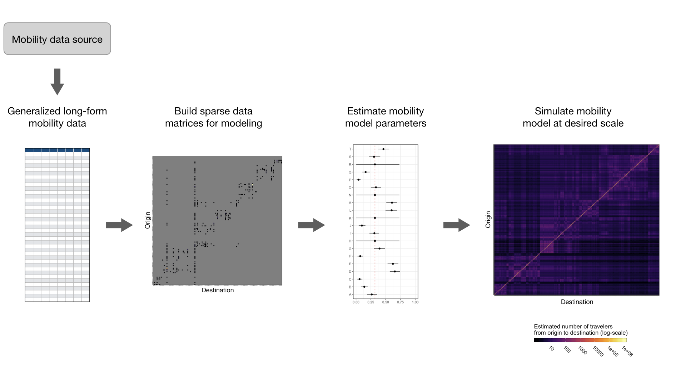
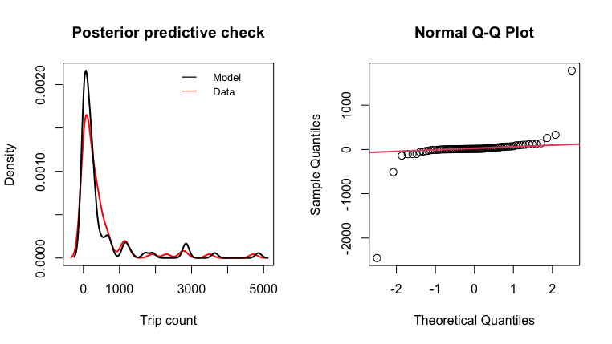

<!-- badges: start -->
[](https://travis-ci.com/COVID-19-Mobility-Data-Network/mobility)
<!-- badges: end -->

# `mobility`: an R package for modeling human mobility patterns

This GitHub repository contains source code to build the `mobility` R package which provides tools for analyzing human mobility data, including functions for parsing travel data, fitting mobility models using Bayesian inference, and simulating mobility patterns. This package is currently in development and maintained by John Giles ([@gilesjohnr](https://github.com/gilesjohnr)) and Amy Wesolowski.

## Rationale
Recently there has been a surge in research that incorporates human mobility data into epidemiological models. Depending on the context, mobility data can be derived from multiple sources such as GPS tracking studies, travel surveys, call data records, or mobile phone applications with location services. In addition, widespread social distancing measures that have been implemented to slow COVID-19 transmission have also spurred several technology companies in the private sector to make data collected by mobile phone applications publicly available. A particular advantage lended by these data is that they offer real-time or near-real-time measures of human mobility at a high spatial resolution, leading to an increased interest in incorporating real-time data on human mobility into spatial models of disease transmission. Given the multitude of mobility data types now available and the impetus to use them in disease models, we developed the R package `mobility` which provides tools to help public health researchers fit and simulate mobility models using different sources of human mobility data. The package will undergo continued development as methods evolve to meet current demand.

## Challenges
Although the initial format of each data type may be different, there are general challenges regarding data sparsity, spatial scale, and statistical uncertainty that make direct use of mobility data in modeling pipelines challenging:

  * **Data sparsity** occurs when observations for some routes of travel are missing, making it difficult to generalize observed mobility patterns for routes of travel that are unobserved. We address data sparsity by fitting mobility models to the data that are observed and then inferring travel for unobserved routes based on estimated model parameters. 

  * The **spatial scale** of the mobility data is often different from that needed by the epidemiological model. Functions in this package account for differences in spatial scale by aggregating travel patterns to a larger spatial scale or extrapolate them to a smaller one using distance and population size covariates.
  
  * **Statistical uncertainty** in the travel patterns found in human mobility data results from the variance in a naturally stochastic process. Depending on the method used to collect the mobility data and the subset of the population represented, measurement error and observation bias also have an impact. To facilitate integration mobilty model uncertainty into disease models, we provide model fitting and simulation tools that allow researchers to simulate the mobility process according to the distribution of estimated model parameters.
  
## Tools
To help facilitate modeling studies that wish to use mobility data and address the challenges above, we have developed a suite of tools that can be used to do some of the heavy lifting required to fit and simulate mobility models. Sections below show the general work-flow, see the package vignettes for more detailed examples.

### General work-flow


### Brief example
#### 1. Generalized long-form mobility data format
There are many sources of travel data that researchers wish to fit models to. So, we have designed a generalized data frame template to standardize travel data from various sources into a longform format that is compatible with the modeling and simulation tools in this package. This data template can be populated by starting with the `travel_data_template` object and adding rows.
```r
library(mobility)
mobility_data <- travel_data_template
n <- 5 # Add some observations
mobility_data[1:n,] <- NA
# add data mobility data to rows
```

#### 2. Build sparse data matrices for modeling
Utility functions take mobility data from the generalized long-form format and build data matrices that are used to fit models.
```r
mobility_data <- cbind(mobility_data, get_unique_ids(mobility_data, adm_start=2))

# Sparse matrix containing trip counts
M <- get_mob_matrix(orig=mobility_data$orig_id,
                    dest=mobility_data$dest_id,
                    value=mobility_data$trips)

# Distance matrix containing distances among all locations
xy <- get_unique_coords(mobility_data)
D <- get_distance_matrix(x=xy[,1],
                         y=xy[,2],
                         id=xy[,3])
                         
# Unique population sizes for all locations
N <- get_pop_vec(mobility_data)
```

#### 3. Estimate mobility model parameters
```r
# Fit a mobility model to data matrices
mod <- fit_mobility(M, D, N)

# Summary statistics of parameter estimates
summarize_mobility(mod)

               Mean          SD       HPD2.5    HPD97.5 Rhat SSeff          AC5
gamma   1.627564815 0.012987392 1.601657e+00 1.65184147 1.01  1155 -0.007112479
omega_1 2.155448977 1.905316057 1.135895e-02 5.88730404 1.00   486  0.154469676
omega_2 0.593836446 0.403373442 2.720367e-05 1.32248529 1.00   704  0.104623413
theta   2.007748972 2.006350454 2.338955e-03 5.93925457 1.00   384  0.207985294
tau_1   0.616436441 0.006884550 6.032836e-01 0.62982560 1.00  1264  0.016804072
tau_2   0.432084468 0.007734690 4.174996e-01 0.44721031 1.00  1159  0.022767959
tau_3   0.431438676 0.007126530 4.174066e-01 0.44479338 1.00  1261  0.022528656
tau_4   0.384766345 0.250618523 2.148511e-07 0.84557558 1.00  2000  0.001937946
tau_5   0.008924998 0.001340494 6.292020e-03 0.01137737 1.00  1243  0.010289810

# Check goodness of fit
check_mobility(M, D, N, mod)
```


#### 4. Simulate mobility model
```r
# Simulate one stochastic realization of a mobility matrix based on fitted mobility model parameters
sim_mobility(D, N, mod, n=1)
             
      destination
origin           A          B          C           D          E
     A 0.287432109 0.04218981 0.02230203 0.062559887 0.03429974
     B 0.022199446 0.48642730 0.05553207 0.009403616 0.07279978
     C 0.005880424 0.02782746 0.86158241 0.003194057 0.02459956
     D 0.151346825 0.04323522 0.02930595 0.378491474 0.03955175
     E 0.019122996 0.07713662 0.05201496 0.009114932 0.51987329
```

Please see package vignettes to explore each step in more detail.

## Installation
To install the install the development version, first install the `devtools` package and then install `mobility` from source via the COVID-19-Mobility-Data-Network GitHub repository:
```r
install.packages('devtools')
devtools::install_github('COVID-19-Mobility-Data-Network/mobility')
```

The model fitting functions in the package perform parameter estimation using the Bayesian MCMC (Markov Chain Monte Carlo) algorithm called JAGS (Just Another Gibbs Sampler). The JAGS 4.3.0 library must be installed [here](http://mcmc-jags.sourceforge.net/). To check your installation of JAGS, you can open your console and type `jags` which should give you the following message.
```console
user@computer:~$ jags
Welcome to JAGS 4.3.0 on Fri May  1 16:05:10 2020
JAGS is free software and comes with ABSOLUTELY NO WARRANTY
Loading module: basemod: ok
Loading module: bugs: ok
. 
```


## Troubleshooting
For general questions, contact John Giles (giles@jhu.edu) and/or Amy Wesolowski (awesolowski@jhu.edu). For technical questions, contact package maintainer John Giles (giles@jhu.edu). To report bugs or problems with code or documentation, please go to the [Issues](https://github.com/COVID-19-Mobility-Data-Network/mobility/issues) page associated with this GitHub page and click *new issue*.

