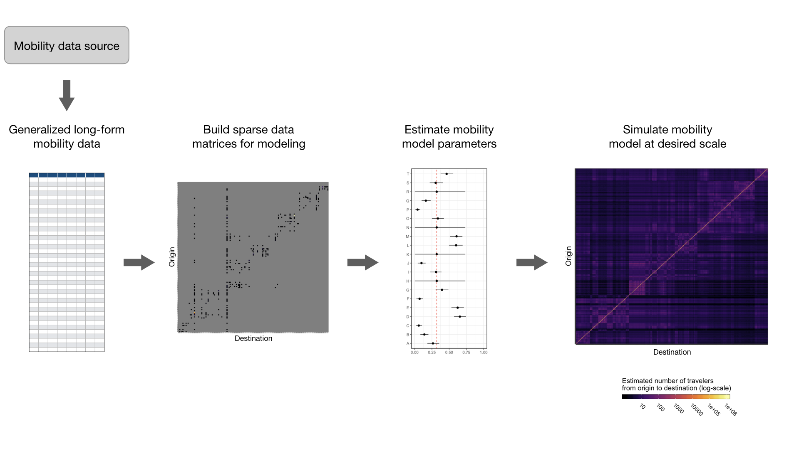
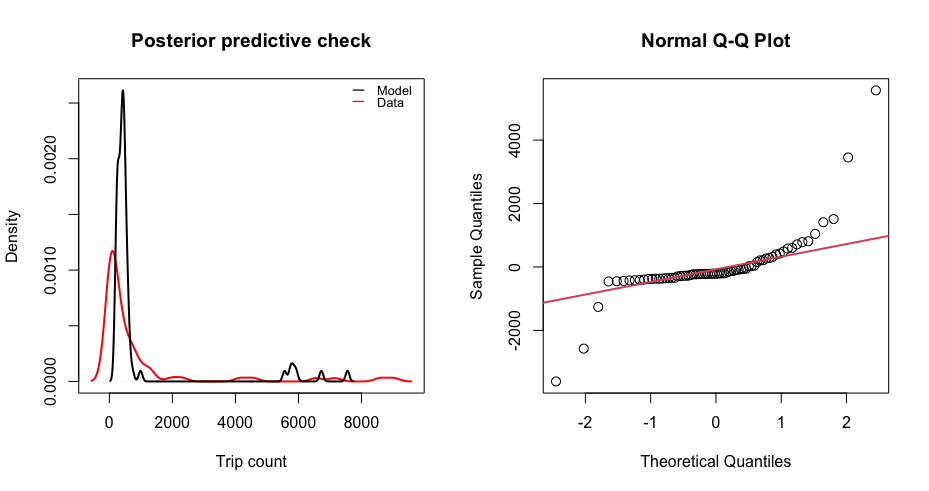

<!-- badges: start -->
[](https://travis-ci.com/COVID-19-Mobility-Data-Network/mobility)
[](https://zenodo.org/badge/latestdoi/261659776)
<!-- badges: end -->


# `mobility`: an R package for modeling human mobility patterns

This GitHub repository contains source code to build the `mobility` R package which provides tools for analyzing human mobility data, including functions for parsing travel data, fitting mobility models using Bayesian inference, and simulating mobility patterns. This package is currently in development and maintained by John Giles ([@gilesjohnr](https://github.com/gilesjohnr)) and Amy Wesolowski.

## Rationale
Recently there has been a surge in research that incorporates human mobility data into epidemiological models. Depending on the context, mobility data can be derived from multiple sources such as GPS tracking studies, travel surveys, call data records, or mobile phone applications with location services. In addition, widespread social distancing measures that have been implemented to slow COVID-19 transmission have spurred several technology companies in the private sector to make data collected by mobile phone applications publicly available. A particular advantage lended by these data is that they offer real-time or near-real-time measures of human mobility at a high spatial resolution, leading to an increased interest in incorporating real-time data on human mobility into spatial models of disease transmission. Given the multitude of mobility data types now available and the impetus to use them in disease models, we developed the R package `mobility` which provides tools to help public health researchers fit and simulate mobility models using different sources of human mobility data. The package will undergo continued development as methods evolve to meet current demand.

## Challenges
Although the initial format of each data type may be different, there are general challenges regarding data sparsity, spatial scale, and statistical uncertainty that make direct use of mobility data in modeling pipelines challenging:

  * **Data sparsity** occurs when observations for some routes of travel are missing, making it difficult to generalize observed mobility patterns for routes of travel that are unobserved. We address data sparsity by fitting mobility models to the data that are observed and then inferring travel for unobserved routes based on estimated model parameters. 

  * The **spatial scale** of the mobility data is often different from that needed by the epidemiological model. Functions in this package account for differences in spatial scale by aggregating travel patterns to a larger spatial scale or extrapolating them to a smaller one using covariates such as distance and population size.
  
  * **Statistical uncertainty** in the travel patterns found in human mobility data results from the variance in a naturally stochastic process. Depending on the method used to collect the mobility data and the subset of the population represented, measurement error and observation bias also have an impact. To facilitate integration of mobilty model uncertainty into disease models, we provide model fitting and simulation tools that allow researchers to simulate the mobility process according to the distribution of estimated model parameters.
  
## Tools
To help facilitate modeling studies that wish to use mobility data and address the challenges above, we have developed a suite of tools that can be used to do some of the heavy lifting required to fit and simulate mobility models. Sections below show the general work-flow, see the package vignettes for more detailed examples.

### General work-flow


### 1. Generalized long-form mobility data format
There are many sources of travel data that researchers wish to fit models to. So, we have designed a generalized data frame template to standardize travel data from various sources into a longform format that is compatible with the modeling and simulation tools in this package. This data template can be populated by starting with the `travel_data_template` object and adding rows.
```r
library(mobility)
mobility_data <- travel_data_template
n <- 5 # Add some observations
mobility_data[1:n,] <- NA
# add data mobility data to rows
```

### 2. Build sparse data matrices for modeling
Utility functions take mobility data from the generalized long-form format and build data matrices that are used to fit models.
```r
mobility_data <- cbind(mobility_data, get_unique_ids(mobility_data, adm_start=2))

# Sparse matrix containing trip counts
M <- get_mob_matrix(orig=mobility_data$orig_id,
                    dest=mobility_data$dest_id,
                    value=mobility_data$trips)

# Distance matrix containing distances among all locations
xy <- get_unique_coords(mobility_data)
D <- get_distance_matrix(x=xy[,1],
                         y=xy[,2],
                         id=xy[,3])
                         
# Unique population sizes for all locations
N <- get_pop_vec(mobility_data)
```

Alternatively, you can create mobility data matrices from your own data source. See the `mobility_matrices` data object for an example of data structure.
```r
str(mobility_matrices)

List of 3
 $ M: num [1:10, 1:10] 4559 NA 25 1964 NA ...
  ..- attr(*, "dimnames")=List of 2
  .. ..$ origin     : chr [1:10] "A" "B" "C" "D" ...
  .. ..$ destination: chr [1:10] "A" "B" "C" "D" ...
 $ D: num [1:10, 1:10] 0 671 1023 521 796 ...
  ..- attr(*, "dimnames")=List of 2
  .. ..$ origin     : chr [1:10] "A" "B" "C" "D" ...
  .. ..$ destination: chr [1:10] "A" "B" "C" "D" ...
 $ N: Named num [1:10] 9868 9511 5561 9596 12741 ...
  ..- attr(*, "names")= chr [1:10] "A" "B" "C" "D" ...
```

### 3. Estimate mobility model parameters
```r
# Fit a mobility model to data matrices
mod <- mobility(data=mobility_matrices, model='gravity', type='power_norm', DIC=TRUE)

summary(mod) # Summary statistics of parameter estimates

                 mean           sd         Q2.5        Q97.5 Rhat n.eff   AC5  AC10
gamma    1.951844e-01 0.0006248893 1.939529e-01 1.964152e-01 1.00   919  0.02  0.01
omega    5.695785e-04 0.0005556265 1.924751e-05 2.087491e-03 1.03   378  0.01  0.02
theta    9.953428e-01 0.0040059916 9.873916e-01 1.003462e+00 1.00  1000  0.01  0.02
DIC      4.424932e+04 2.8947540122 4.424574e+04 4.425680e+04 1.00   659 -0.05 -0.01
deviance 4.424504e+04 2.8947540122 4.424146e+04 4.425251e+04 1.00   659 -0.05 -0.01
pD       2.141799e+00           NA           NA           NA   NA    NA    NA    NA

check(mod) # Check goodness of fit

$DIC
[1] 44249.32

$RMSE
[1] 1046.458

$MAPE
[1] 5.578757

$R2
[1] 0.712208
```


### 4. Predict expected mean mobility values
```r
# Predict the expected mean number of trips using fitted mobility model parameters
pred <- predict(mod)
pred[1:5,1:5]

      destination
origin         A         B         C         D         E
     A 5819.4341  424.1779  390.5899  445.6444  410.3822
     B  405.2726 5559.8336  456.8372  362.2968  439.9313
     C  224.5727  274.9148 3343.7435  207.3500  259.8844
     D  453.4775  385.8624  366.9740 5921.5336  382.2572
     E  532.6940  597.6884  586.7235  487.6157 7556.0780
```

### 5. Simulate stochastic realizations of a mobility model
```r
sim <- predict(mod, nsim=3, seed=123)
sim[1:5,1:5,]

, , 1

          A         B         C         D         E
A 5819.2934  426.1649  392.4692  447.6925  412.3339
B  407.1690 5559.6542  458.8656  364.0649  441.9293
C  225.6655  276.1520 3343.6948  208.3886  261.0833
D  455.5835  387.7662  368.8098 5921.6621  384.1542
E  535.2219  600.3998  589.3920  490.0069 7555.9685

, , 2

          A         B         C         D         E
A 5785.3651  422.5080  389.0609  443.8742  408.7853
B  403.6777 5527.2621  454.9804  360.9001  438.1816
C  223.7098  273.8168 3324.1344  206.5649  258.8627
D  451.6861  384.3829  365.5662 5886.9730  380.8022
E  530.6073  595.2950  584.3594  485.7362 7511.9216

, , 3

          A         B         C         D         E
A 5833.9490  419.7001  386.1108  441.0524  406.0959
B  401.0265 5573.7552  452.0747  358.2909  435.6061
C  222.1749  272.2446 3351.0992  205.0489  257.3595
D  448.7633  381.5303  362.5781 5935.4389  378.0528
E  526.9251  591.5347  580.3331  482.1094 7575.6664
```


Please see package vignettes to explore each step in more detail.

## Installation

#### Step 1: Check that JAGS 4.3.0 is installed
The model fitting functions in the package perform parameter estimation using the Bayesian MCMC (Markov Chain Monte Carlo) algorithm called JAGS (Just Another Gibbs Sampler), which requires the JAGS library version >= 4.3.0 to be installed. 

  * If you do not have the JAGS 4.3.0 library installed, download [HERE](https://sourceforge.net/projects/mcmc-jags/files/).
  * If you already have an installation of the JAGS library, check that the version is >= 4.3.0 by opening your console and typing `jags` which should give you the following message:
```console
user@computer:~$ jags
Welcome to JAGS 4.3.0 on Fri May  1 16:05:10 2020
JAGS is free software and comes with ABSOLUTELY NO WARRANTY
Loading module: basemod: ok
Loading module: bugs: ok
. 
```

#### Step 2: Install `mobility` from Github
Use the `devtools` package to install the development version of `mobility` from the COVID-19-Mobility-Data-Network GitHub repository. The source code and its dependencies should be backwards compatible with previous R versions, but we recommend R version >= 3.6.2.
```r
install.packages('devtools')
devtools::install_github('COVID-19-Mobility-Data-Network/mobility')
```


## Troubleshooting
For general questions, contact John Giles (jrgiles@uw.edu) and/or Amy Wesolowski (awesolowski@jhu.edu). For technical questions, contact package maintainer John Giles (jrgiles@uw.edu). To report bugs or problems with code or documentation, please go to the [Issues](https://github.com/COVID-19-Mobility-Data-Network/mobility/issues) page associated with this GitHub page and click *new issue*.

